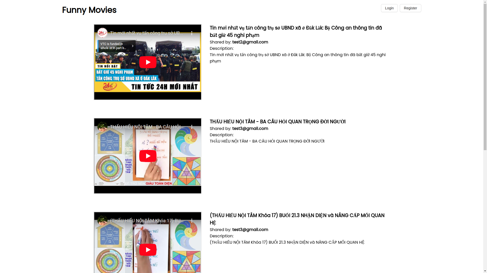

# YTB SHARING APP

## 1. Introduce

1. User registration and login.
2. Sharing YouTube videos.
3. Viewing a list of shared videos.
4. Real-time notifications for new video shares: When a user shares a new video, other logged-in users should receive a real-time notification about the newly shared video. This notification can be displayed as a pop-up or a banner in the application, and it should contain the video title and the name of the user who shared it.

## 2.Prerequisites

- Nestjs
- Mongodb
- Postgresql
- Bull(redis)
- Prisma(Orm tool)
- Reactjs
- Docker
- Nginx

## 3.Installation

clone https://github.com/dthang3007/ytb-sharing-app

For API:

- install Postgresql Mongodb
- cd ytb-sharing-be
- npm or yarn install
- npx prisma generate --schema ./prisma/schema.prisma
- npm run prisma:deploy
- copy .env.example > .env
- yarn start:dev to run dev

For FE:

- cd ytb-sharing-be
- copy .env.example > .env
- npm or yarn install
- yarn start to run dev

## 4. Database Setup

- install Postgresql Mongodb
- cd ytb-sharing-be
- npm or yarn install
- npm run prisma:deploy

## 5. Running the Application

- Access app in localhost:3000
  

## 6. Docker Deployment

- install docker, docker-compose
- cd ytb-sharing-fe yarn install and build(just need folder build for docker)
- In ytb-sharing-fe and ytb-sharing-be copy .env.production > .env
- In root project folder run cli: docker-compose up -d
- When image and container installed run cli:
  - docker exec -it web-api-c bin/bash
  - npm run prisma:deploy
    -Done

## 7. Usage

- I use JWT to authen/author
- Link must be a ytb link(limited to specific this cases to show exactly video)
- List link is infinity scroll
- When you receive a notification, you can disable the notification by clicking on the red notification.
  Notification function I split the process of notification processing, when the user shares a path I will not directly call the main database (porstgres) to save the notification or emit notification to the user, instead I
  use queue to save 1 message containing the message just created at the same time there will be service consumer to process (save the information of the notification for each user) and push in another queue when the message has been saved successfully (I use mongo because it is NoSQL obtain the data will be faster than the creation of another 1 table in the main database -> reduce the load for the database and also accelerate the notice to the user ) this queue is for the consumer emit notification (email, phone, message) in this case simply socket emits, I split the process to easily scale and manage each module will be easier

## 8. Troubleshooting

- I apologize for not being able to finish the project perfectly despite my best efforts (a lot of test cases) in the time allowed.

- Part of the product deployment because I do not want to cost a lot because of the construction of many services so I use a personal computer as a server so there will be quite a lot of inaccessibility (loss of power, weak machine suddenly stops) I hope you can understand.
